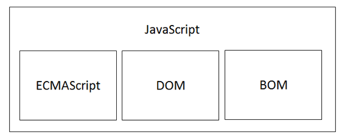
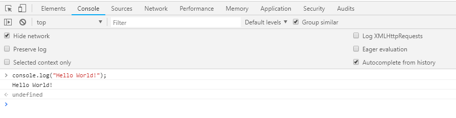
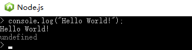

### JavaScript介绍

JavaScript是一门跨平台、面向对象的轻量级脚本语言，运行于JavaScript解释器/引擎

JavaScript内置了一个包含一系列对象的标准库，比如数组、日期、数学和一个语言元素集合包括操作符、流程控制及语句等内容。

JavaScript解释器是作为JavaScript脚本代码的运行环境，如下述两种呈现方式：

- 独立安装的JavaScript解析器


- 嵌入在浏览器内核中的JavaScript解析器


虽然JavaScript与`ECMAScript`经常被认为是相同含义，但是JavaScript的含义要比`ECMAScript`多。一个完整的JavaScript实现应该由下列三个不同的部分组成：

- 核心语法内容（ECMAScript）
- 文档对象模型（DOM）
- 浏览器对象模型（BOM）



### 运行环境

- 基于浏览器



- 基于解释器



### 代码调试

+ console控制台

console用于提供控制台标准输出，它是一种调试工具，后来逐渐成为了标准

| 方法                | 描述                               |
| ----------------- | -------------------------------- |
| `console.log()`   | 向标准输出流打印字符并以换行符结束                |
| `console.info()`  | 向标准输出流打印信息性消息。输出文字外，会显示一个蓝色的惊叹号。 |
| `console.warn()`  | 向标准输出流打印警告性消息。输出文字外，会显示一个黄色的惊叹号。 |
| `console.error()` | 向标准输出流打印错误性消息。输出文字外，会显示一个红色的叉子。  |

+ node.js调试

基于Chrome V8引擎的Node.js解析器提供了一个强大的调试器，帮助开发人员调试应用程序。

```javascript
//在JavaScript代码中添加debugger语句，debugger语句相当于在代码中标注一个断点
var str = "这是一个测试内容.";
debugger;
console.log(str);
//以debug方式运行JavaScript代码
node debug debugger.js
```