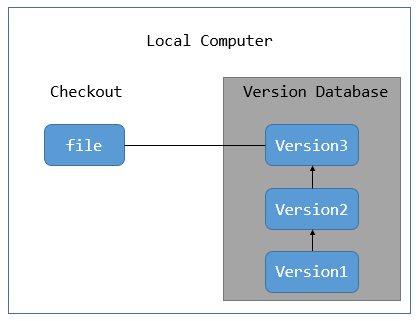
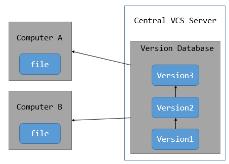
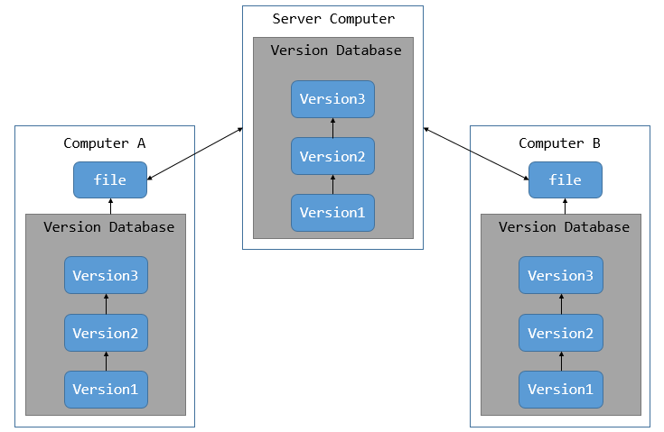
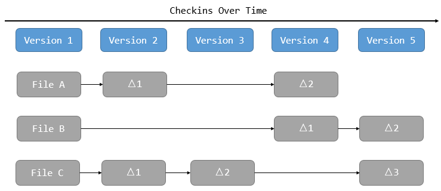
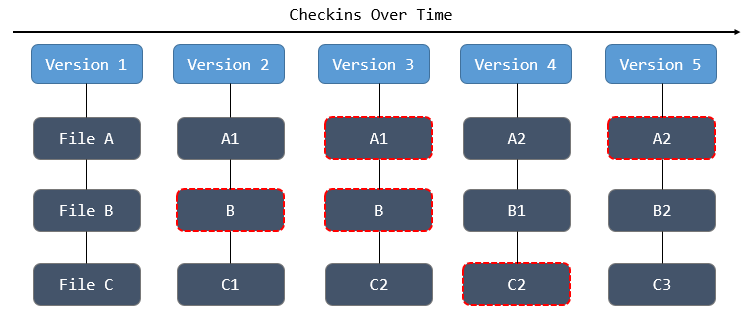

### git简介

- Git是一个开源的分布式版本控制系统，用于敏捷高效地处理任何或小或大的项目。
- Git 是 Linus Torvalds 为了帮助管理 Linux 内核开发而开发的一个开放源码的版本控制软件。
- Git 与常用的版本控制工具 CVS, Subversion 等不同，它采用了分布式版本库的方式，不必服务器端软件支持。

### 关于版本控制

**版本控制是一种记录一个或若干文件内容变化，以便将来查阅特定版本修订情况的系统。**

+ 版本控制可以将某一个文件回溯到以前的状态,甚至将整个项目都回退到过去某个时间点的状态

+ 可以比较文件的变化细节,查出最后是谁修改了哪个地方,从而找出导致怪异问题出现的原因，又是谁在何时报告了某个功能缺陷

#### 本地版本控制

本地版本控制系统：采用某种简单的数据库来记录文件的历次更新差异

#### 集中化的版本控制系统

集中化的版本控制系统（Centralized Version Control Systems，简称 CVCS）都有一个单一的集中管理的服务器，保存所有文件的修订版本，而协同工作的人们都通过客户端连到这台服务器，取出最新的文件或者提交更新

+ 好处：每个人都可以在一定程度上看到项目中的其他人正在做些什么， 而管理员也可以轻松掌控每个开发者的权限，并且管理一个 CVCS 要远比在各个客户端上维护本地数据库来得轻松容易**（即实现了不同开发者的协同的工作）**

+ 不足：如果中央服务器发生故障，谁都无法提交更新，也就无法协同工作；如果中心数据库所在的磁盘发生损坏，又没有做恰当备份，将丢失所有数据——包括项目的整个变更历史，只剩下人们在各自机器上保留的单独快照**（集中化可能导致中心数据库丢失或者中心服务器发生故障）**

#### 分布式版本控制系统

分布式版本控制系统（Distributed Version Control System，简称 DVCS）是指客户端并不只提取最新版本的文件快照，而是**把代码仓库完整地镜像下来** 。常见的分布式版本控制系统有：Git、Mercurial、Bazaar、Darcs 等

+ 任何一处协同工作用的服务器发生故障，事后都可以用任何一个镜像出来的本地仓库恢复。 因为每一次的克隆操作，实际上都是一次对代码仓库的完整备份。

+ 许多这类系统都可以指定和若干不同的远端代码仓库进行交互。籍此，你就可以在同一个项目中，分别和不同工作小组的人相互协作。 你可以根据需要设定不同的协作流程，比如层次模型式的工作流，而这在以前的集中式系统中是无法实现的。

### 直接记录快照，而非差异比较

Git 和其它版本控制系统的主要差别在于 Git **对待数据的方法**。 

+ 大部分系统以文件变更列表的方式存储信息，这类系统将它们保存的信息看作是一组基本文件和每个文件随时间逐步累积的差异。

+ Git 更像是把数据看作是对小型文件系统的一组快照。 每次你提交更新，或在 Git 中保存项目状态时，它主要对当时的全部文件制作一个快照并保存这个快照的索引。 为了高效，如果文件没有修改，Git 不再重新存储该文件，而是只保留一个链接指向之前存储的文件。 Git 对待数据更像是一个 **快照流**。

