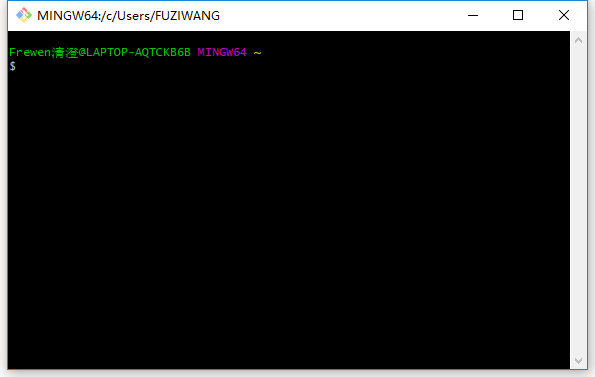
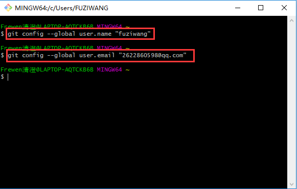

### 在Linux上安装Git

针对`Ubuntu Linux`来说安装`git`需要通过命令来进行

```shell
frewen@ubuntu:~$ sudo apt-get install git
frewen@ubuntu:~$ git --version // 可以查看版本
```

### 在Windows上安装Git

在Windows上使用Git，可以从Git官网直接[下载安装程序](https://git-scm.com/downloads)，然后按默认选项安装即可。

安装完成后，在开始菜单里找到“Git”->“Git Bash”，蹦出一个类似命令行窗口的东西，就说明Git安装成功！



安装完成后，还需要最后一步设置，在命令行输入：

```git
$ git config --global user.name "Your Name" // 全局的配置
$ git config --global user.email "email@example.com" // 全局的配置
```

因为Git是分布式版本控制系统，所以，每个机器都必须自报家门：你的名字和Email地址。

注意：`git config`命令的`--global`参数，用了这个参数，表示你这台机器上所有的Git仓库都会使用这个配置，当然也可以对某个仓库指定不同的用户名和Email地址。



