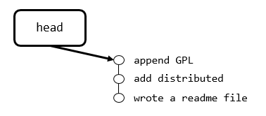
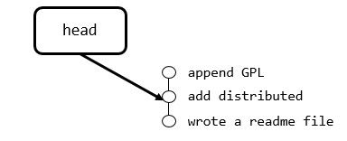

### 版本回退

现在，你已经学会了修改文件，然后把修改提交到Git版本库，现在，再练习一次，修改readme.txt文件如下：

```txt
Git is a distributed version control system.
Git is free software distributed under the GPL.
```

然后尝试提交：

```bash
$ git add readme.txt
$ git commit -m "append GPL"
[master 1094adb] append GPL
 1 file changed, 1 insertion(+), 1 deletion(-)
```

Git除了可以进行修改，还可以进行版本的回退，每当你觉得文件修改到一定程度的时候，就可以**“保存一个快照”**，这个快照在Git中被称为`commit`。一旦你把文件改乱了，或者误删了文件，还可以从最近的一个`commit`恢复，然后继续工作，而不是把几个月的工作成果全部丢失。

现在，我们回顾一下`readme.txt`文件一共有几个版本被提交到Git仓库里了：

版本1：wrote a readme file

```txt
Git is a version control system.
Git is free software.
```

版本2：add distributed

```txt
Git is a distributed version control system.
Git is free software.
```

版本3：append GPL

```txt
Git is a distributed version control system.
Git is free software distributed under the GPL.
```

版本控制系统肯定有某个命令可以告诉我们历史记录，在Git中，我们用`git log`命令查看：

```bash
$ git log
commit 1094adb7b9b3807259d8cb349e7df1d4d6477073 (HEAD -> master)
Author: Michael Liao <askxuefeng@gmail.com>
Date:   Fri May 18 21:06:15 2018 +0800

    append GPL

commit e475afc93c209a690c39c13a46716e8fa000c366
Author: Michael Liao <askxuefeng@gmail.com>
Date:   Fri May 18 21:03:36 2018 +0800

    add distributed

commit eaadf4e385e865d25c48e7ca9c8395c3f7dfaef0
Author: Michael Liao <askxuefeng@gmail.com>
Date:   Fri May 18 20:59:18 2018 +0800

    wrote a readme file
```

`git log`命令显示从最近到最远的提交日志，我们可以看到3次提交，最近的一次是`append GPL`，上一次是`add distributed`，最早的一次是`wrote a readme file`。

如果嫌输出信息太多，看得眼花缭乱的，可以试试加上`--pretty=oneline`参数：

```bash
$ git log --pretty=oneline
1094adb7b9b3807259d8cb349e7df1d4d6477073 (HEAD -> master) append GPL
e475afc93c209a690c39c13a46716e8fa000c366 add distributed
eaadf4e385e865d25c48e7ca9c8395c3f7dfaef0 wrote a readme file
```

需要友情提示的是，你看到的一大串类似`1094adb...`的是`commit id`（版本号），和SVN不一样，Git的`commit id`不是1，2，3……递增的数字，而是一个SHA1计算出来的一个用十六进制表示出来的非常大的数字，并且每一个人的`commit id`都不同。为什么`commit id`需要用这么一大串数字表示呢？因为Git是分布式的版本控制系统，后面我们还要研究多人在同一个版本库里工作，如果大家都用1，2，3……作为版本号，那肯定就冲突了。

**准备把`readme.txt`回退到上一个版本，也就是`add distributed`的那个版本，怎么做呢？**

首先，Git必须知道当前版本是哪个版本，在Git中，用`HEAD`表示当前版本，也就是最新的提交`1094adb...`，上一个版本就是`HEAD^`，上上一个版本就是`HEAD^^`，当然往上100个版本写100个`^`比较容易数不过来，所以写成`HEAD~100`。

现在，我们要把当前版本`append GPL`回退到上一个版本`add distributed`，就可以使用`git reset`命令：

```bash
$ git reset --hard HEAD^
HEAD is now at e475afc add distributed
```

看看`readme.txt`的内容是不是版本`add distributed`：

```bash
$ cat readme.txt
Git is a distributed version control system.
Git is free software.
```

还可以继续回退到上一个版本`wrote a readme file`，不过且慢，然我们用`git log`再看看现在版本库的状态：

```bash
$ git log
commit e475afc93c209a690c39c13a46716e8fa000c366 (HEAD -> master)
Author: Michael Liao <askxuefeng@gmail.com>
Date:   Fri May 18 21:03:36 2018 +0800

    add distributed

commit eaadf4e385e865d25c48e7ca9c8395c3f7dfaef0
Author: Michael Liao <askxuefeng@gmail.com>
Date:   Fri May 18 20:59:18 2018 +0800

    wrote a readme file
```

最新的那个版本`append GPL`已经看不到了！如何再恢复撤销的版本？只要上面的命令行窗口还没有被关掉，你就可以顺着往上找啊找啊，找到那个`append GPL`的`commit id`是`1094adb...`，于是就可以指定回到未来的某个版本：

```bash
$ git reset --hard 1094a
HEAD is now at 83b0afe append GPL
```

版本号没必要写全，前几位就可以了，Git会自动去找。当然也不能只写前一两位，因为Git可能会找到多个版本号，就无法确定是哪一个了。

再小心翼翼地看看`readme.txt`的内容：

```bash
$ cat readme.txt
Git is a distributed version control system.
Git is free software distributed under the GPL.
```

Git的版本回退速度非常快，因为Git在内部有个指向当前版本的`HEAD`指针，当你回退版本的时候，Git仅仅是把HEAD从指向`append GPL`：



改为指向`add distributed`：



然后顺便把工作区的文件更新了。所以你让`HEAD`指向哪个版本号，你就把当前版本定位在哪。

现在，你回退到了某个版本，关掉了电脑，第二天早上就后悔了，想恢复到新版本怎么办？找不到新版本的`commit id`怎么办？Git提供了一个命令`git reflog`用来记录你的每一次命令：

```
$ git reflog
e475afc HEAD@{1}: reset: moving to HEAD^
1094adb (HEAD -> master) HEAD@{2}: commit: append GPL
e475afc HEAD@{3}: commit: add distributed
eaadf4e HEAD@{4}: commit (initial): wrote a readme file
```

从输出可知，`append GPL`的commit id是`1094adb`，现在，你又可以根据新版本的id进行版本的回退
