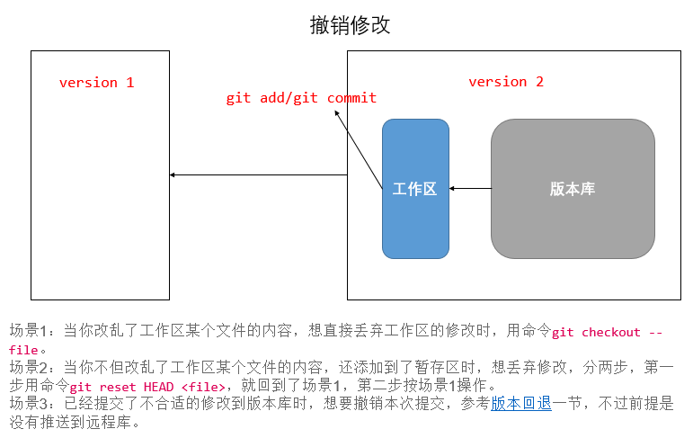

### 撤销修改

现在，你在`readme.txt`中添加了一行：

```bash
$ cat readme.txt
Git is a distributed version control system.
Git is free software distributed under the GPL.
Git has a mutable index called stage.
Git tracks changes of files.
My stupid boss still prefers SVN.
```

你可以删掉最后一行，手动把文件恢复到上一个版本的状态。如果用`git status`查看一下：

```bash
$ git status
On branch master
Changes not staged for commit:
  (use "git add <file>..." to update what will be committed)
  (use "git checkout -- <file>..." to discard changes in working directory)

    modified:   readme.txt

no changes added to commit (use "git add" and/or "git commit -a")
```

你可以发现，Git会告诉你，`git checkout -- file`可以丢弃工作区的修改：

```bash
$ git checkout -- readme.txt
```

命令`git checkout -- readme.txt`意思就是，把`readme.txt`文件在工作区的修改全部撤销，这里有两种情况：

一种是`readme.txt`自修改后还没有被放到暂存区，现在，撤销修改就回到和版本库一模一样的状态；

一种是`readme.txt`已经添加到暂存区后，又作了修改，现在，撤销修改就回到添加到暂存区后的状态。

**总之，就是让这个文件回到最近一次`git commit`或`git add`时的状态。**

现在，看看`readme.txt`的文件内容：

```bash
$ cat readme.txt
Git is a distributed version control system.
Git is free software distributed under the GPL.
Git has a mutable index called stage.
Git tracks changes of files.
```

文件内容果然复原了。

现在，你不但写了一些胡话，还`git add`到暂存区了：

```bash
$ cat readme.txt
Git is a distributed version control system.
Git is free software distributed under the GPL.
Git has a mutable index called stage.
Git tracks changes of files.
My stupid boss still prefers SVN.

$ git add readme.txt
```

庆幸的是，在`commit`之前，你发现了这个问题。用`git status`查看一下，修改只是添加到了暂存区，还没有提交：

```bash
$ git status
On branch master
Changes to be committed:
  (use "git reset HEAD <file>..." to unstage)

    modified:   readme.txt
```

Git同样告诉我们，用命令`git reset HEAD `可以把暂存区的修改撤销掉（unstage），重新放回工作区：

```bash
$ git reset HEAD readme.txt
Unstaged changes after reset:
M    readme.txt
```

`git reset`命令既可以回退版本，也可以把暂存区的修改回退到工作区。当我们用`HEAD`时，表示最新的版本。

再用`git status`查看一下，现在暂存区是干净的，工作区有修改：

```bash
$ git status
On branch master
Changes not staged for commit:
  (use "git add <file>..." to update what will be committed)
  (use "git checkout -- <file>..." to discard changes in working directory)

    modified:   readme.txt
```

还记得如何丢弃工作区的修改吗？

```bash
$ git checkout -- readme.txt

$ git status
On branch master
nothing to commit, working tree clean
```



