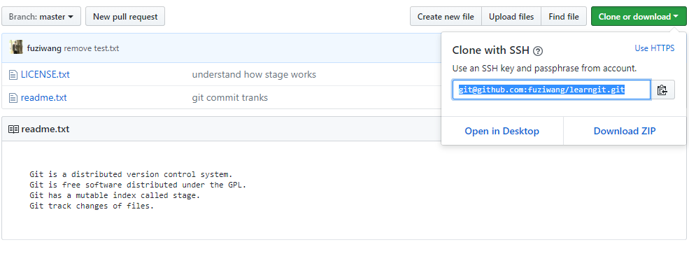

### 从远程库克隆

上次我们讲了先有本地库，后有远程库的时候，如何关联远程库。

现在，假设我们已经创建了远程库，然后，从远程库克隆。



现在，远程库已经准备好了，下一步是用命令`git clone`克隆一个本地库：

```bash
$ git clone git@github.com:fuziwang/learngit.git
Cloning into 'gitskills'...
remote: Counting objects: 3, done.
remote: Total 3 (delta 0), reused 0 (delta 0), pack-reused 3
Receiving objects: 100% (3/3), done.
```

注意把Git库的地址换成你自己的，然后进入`learngit`目录看看，已经有上述的文件了：

```bash
$ cd learngit
$ ls
LICENSE.txt  readme.txt
```

如果有多个人协作开发，那么每个人各自从远程克隆一份就可以了。

你也许还注意到，GitHub给出的地址不止一个，还可以用`https://github.com/fuziwang/learngit.git`这样的地址。实际上，Git支持多种协议，默认的`git://`使用ssh，但也可以使用`https`等其他协议。

使用`https`除了速度慢以外，还有个最大的麻烦是每次推送都必须输入口令，但是在某些只开放http端口的公司内部就无法使用`ssh`协议而只能用`https`。

